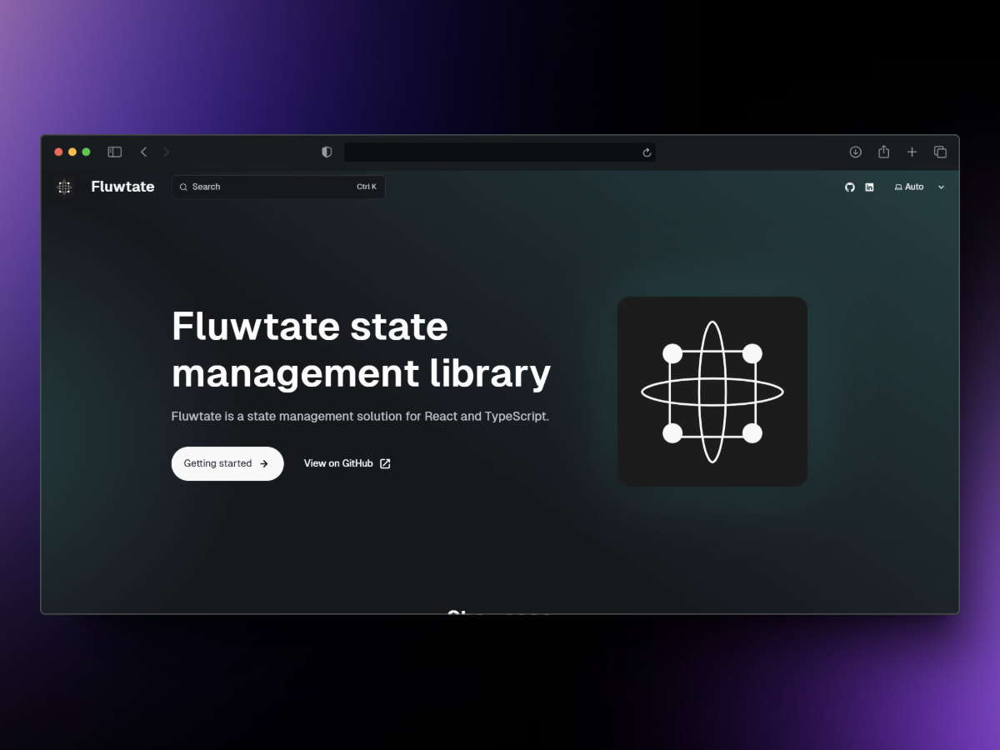

# Fluwtate

Fluwtate is a simple, lightweight state management library for React applications. It provides a store system that allows for efficient state management, persistence, and modular organization. This library supports both synchronous and asynchronous state updates, as well as integration with Redux DevTools.

## Features

- **Store Management**: A reactive store system that allows you to store and update application state.
- **Persistence**: Supports both synchronous and asynchronous state persistence with local storage.
- **Modular State**: Allows splitting the state into modules for better organization.
- **DevTools Integration**: Easy integration with Redux DevTools for state inspection.
- **React Hooks**: Custom hooks for subscribing to specific slices of the store's state.

---

## Installation

To install Fluwtate in your project, run the following command:

```bash
npm install fluwtate

yarn add fluwtate

pnpm add Fluwtate
```

---

## Setting Up Your Store

To start using the library, you need to create your global store. Follow these steps:

1. Create a Store
Begin by defining the initial state of your application and creating the store:

```ts
import { createStore } from "fluwtate";

const initialState = {
  user: null,
  todos: [],
};

export const store = createStore(initialState);
```

2. Creating a Module

A module is a self-contained part of your state that can be reused across different parts of your application. It's a great way to organize your state and make it easier to manage and update.

To create a module, use the `createModule` function:

```ts
import { createModule } from "fluwtate";

const userModule = createModule(store, "user");
```

The `createModule` function takes two arguments: the store and the name of the module.

3. Add Middleware (Optional)
Middleware allows you to extend the functionality of the store. For example, logging state changes:

```ts
import { createStore, devtool } from "fluwtate";

const store = createStore({
  user: null,
  todos: [],
});

store.use(devtool("CustomStore"));
```

4. React Integration
To connect the store with your React components, use the useStore hook:

```tsx
import { useStore } from "fluwtate";
import { store } from "./store";

function App() {
  const todos = useStore(store, (state) => state.todos);

  return (
    <div>
      <h1>Todos</h1>
      <ul>
        {todos.map((todo, index) => (
          <li key={index}>{todo}</li>
        ))}
      </ul>
    </div>
  );
}
```
